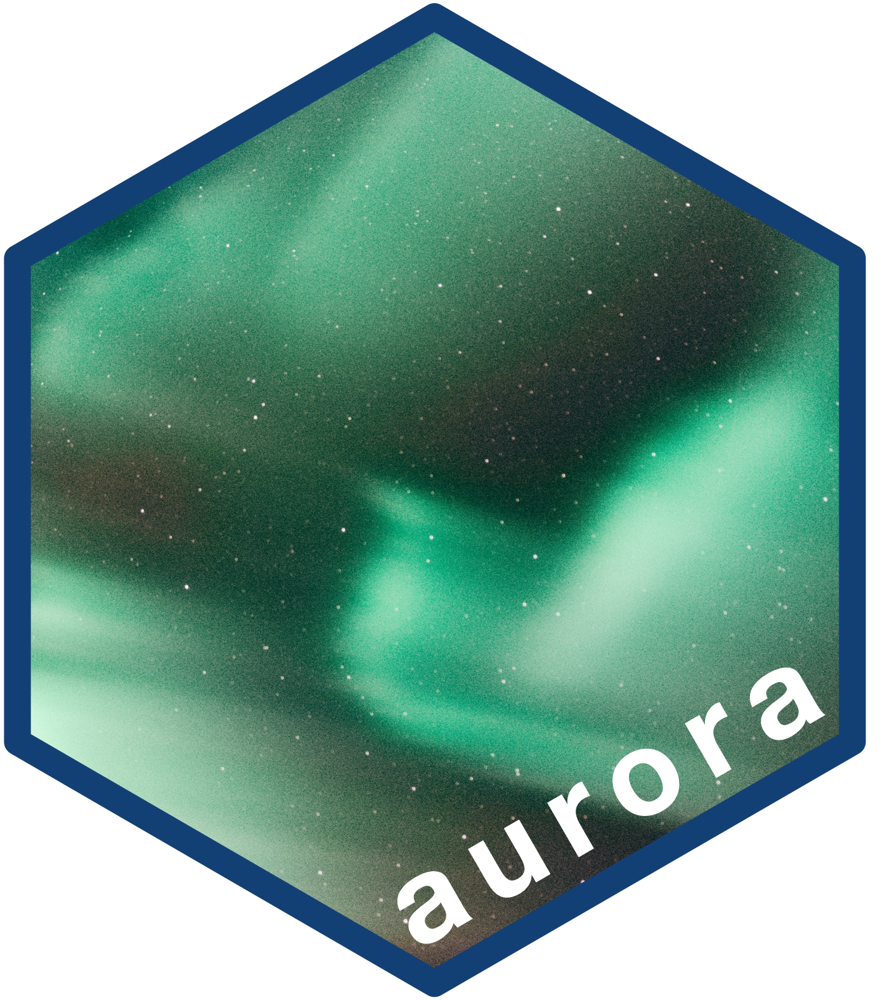

<!-- README.md is generated from README.Rmd. Please edit that file -->

```{r, include = FALSE}
knitr::opts_chunk$set(
  collapse = TRUE,
  comment = "#>",
  fig.path = "man/figures/README-",
  out.width = "100%"
)
```

# aurora: Interface to the Oxord University Research Archive (ORA) API 

<!-- badges: start -->
[](https://www.repostatus.org/#wip)
[](https://lifecycle.r-lib.org/articles/stages.html#experimental)
[](https://github.com/OxfordIHTM/ourora/actions/workflows/R-CMD-check.yaml)
[](https://app.codecov.io/gh/OxfordIHTM/ourora?branch=main)
[](https://www.codefactor.io/repository/github/oxfordihtm/aurora)
<!-- badges: end -->

The [Oxford University Research Archive (ORA)](https://ora.ox.ac.uk/) is an Open Access platform and is the institutional repository for the [University of Oxford](https://ox.ac.uk). ORA serves as a permanent and secure online archive of research materials produced by members of the University of Oxford. ORA supports and participates in the Open Archives Initiative (OAI). ORA is a registered OAI-PMH data-provider and provides metadata for all public records which is updated as soon as each record is published or updated. ORA also provides API access to its resources. This package provides low level functions to interface with the [ORA API](https://ora.ox.ac.uk/api).

## What does `aurora` do?

Please note that `aurora` is still highly experimental and is undergoing a lot of development. Hence, any functionalities described below and in the rest of the package documentation have a high likelihood of changing interface or approach as we aim for a stable working version.

Currently, the package provides functions that wrap each of the verb request endpoints provided by [OAI 2.0](https://www.openarchives.org/OAI/openarchivesprotocol.html):

* `Identify`
* `ListRecords`
* `ListSets`
* `ListMetadataFormats`
* `ListIdentifiers`

From here, the plan is to develope functions that structure these XML OAI responses into tabular formats useful for analysis.

## Installation

`aurora` is not yet on CRAN but can be installed from the [Oxford IHTM R-universe](https://oxfordihtm.r-universe.dev) as follows:

```{r install-r-universe, eval = FALSE}
install.packages(
  "aurora",
  repos = c('https://oxfordihtm.r-universe.dev', 'https://cloud.r-project.org')
)
```

## Usage

## Citation

If you find the `aurora` package useful please cite using the suggested citation provided by a call to the `citation()` function as follows:

```{r citation}
citation("aurora")
```

## Community guidelines

Feedback, bug reports and feature requests are welcome; file issues or seek support [here](https://github.com/OxfordIHTM/aurora/issues). If you would like to contribute to the package, please see our [contributing guidelines](https://oxford-ihtm.io/aurora/CONTRIBUTING.html).

This project is released with a [Contributor Code of Conduct](https://oxford-ihtm.io/aurora/CODE_OF_CONDUCT.html). By participating in this project you agree to abide by its terms.
